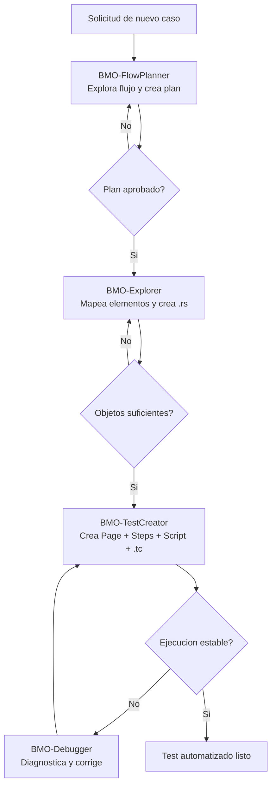

# BMO Agents - Guia Operativa

Este documento describe la responsabilidad de cada agente BMO, sus funciones y el workflow recomendado para llegar a la creacion de tests automatizados en Katalon Mobile.

## Quick Start (pipeline autónomo con QA-Automatizador)

Cuando quieras automatizar un flujo completo sin intervención, usa directamente:

```
@QA-Automatizador Automatiza el flujo de <descripción> en <plataforma>
```

El orquestador se encarga de todo: planificar, validar, aprobar, capturar y crear la automatización.

## Quick Start (manual — agentes individuales)

Usa esta guia cuando necesites controlar individualmente cada agente.

### Cuando usar cada agente

- `QA-Automatizador`: cuando quieres el pipeline completo autónomo sin aprobar el plan manualmente.
- `BMO-FlowPlanner`: cuando aun no tienes claro el flujo o quieres generar solo el plan.
- `BMO-Explorer`: cuando necesitas validar un plan Draft O mapear objetos `.rs` faltantes.
- `BMO-TestCreator`: cuando ya existe un plan Approved y necesitas construir el test.
- `BMO-Debugger`: cuando el test falla y necesitas diagnóstico + fix mínimo.

### Secuencia recomendada (pipeline autónomo)

```
1. QA-Automatizador recibe la solicitud
2. ↓ Invoca BMO-FlowPlanner → genera plan (PlanStatus: Draft)
3. ↓ Invoca BMO-Explorer (VALIDACIÓN) → aprueba o rechaza el plan
     Si rechazado: vuelve a FlowPlanner con RejectionNotes (máx 3 intentos)
4. ↓ Invoca BMO-Explorer (CAPTURA) → crea .rs con UIAutomator dump
5. ↓ Invoca BMO-TestCreator → crea Page + Steps + Script + .tc
6. ↓ (si falla) invoca BMO-Debugger → fix mínimo
7. Reporta resultado al usuario
```

### Regla de aprobación del plan

**El usuario ya NO aprueba el plan.** BMO-Explorer valida el plan contra el dispositivo real y decide:
- `PlanStatus: Approved` (ApprovedBy: BMO-Explorer) → pipeline continúa
- `PlanStatus: Rejected` (+ RejectionNotes) → FlowPlanner ajusta el plan (hasta 3 intentos)

### Checklist rapido antes de automatizar

- Flujo descrito claramente al QA-Automatizador (o al FlowPlanner directamente).
- Dispositivo conectado y adb funcionando (`adb devices`).
- App Rappi instalada en el dispositivo.

### Prompt templates rapidos

- Orquestador full: `Automatiza el flujo <flujo> en android. Usa QA-Automatizador.`
- Solo plan: `Explora el flujo <flujo> y genera el plan con FlowPlanner.`
- Solo captura objetos: `Mapea la pantalla <pantalla> y genera .rs faltantes.`
- Solo crear test: `Con el plan aprobado de <run-id>, crea la automatización.`
- Solo debug: `Este test falla en <paso/error>. Diagnostica y aplica fix mínimo.`

## Principio rector

Todos los agentes BMO deben tomar como fuente de verdad el skill:

- `/Users/jhonsebastianrianoramirez/Katalon Studio/testAndroid/.github/skills/katalon-mobile-automation/SKILL.md`

Si hay conflicto entre un agente y el skill, prevalece el skill.

## Mapa de responsabilidades

### QA-Automatizador (NUEVO — Orquestador)

Responsabilidad principal:
- Coordinar el pipeline completo de forma autónoma.

Funciones:
- Invocar FlowPlanner → Explorer (validate) → Explorer (capture) → TestCreator → Debugger.
- Gestionar el estado del pipeline en `.github/agents/context/orchestrator/`.
- Manejar el ciclo de retries si el plan es rechazado (máx 3 intentos).
- Reportar resultado final al usuario.

No debe:
- Escribir código ni archivos de automatización directamente.

---

### BMO-FlowPlanner

Responsabilidad principal:
- Explorar y validar el flujo funcional antes de automatizar.

Funciones:
- Validar precondiciones del caso (sesion, permisos, conectividad, estado inicial).
- Recorrer el flujo en dispositivo real con evidencia por paso.
- Identificar bifurcaciones, riesgos y puntos de fallo.
- Entregar plan de automatizacion con pasos, datos, riesgos y criterios de aceptacion.
- Guardar hallazgos/locators exploratorios por chat en `.github/agents/context/flowplanner/`.
- Registrar estado inicial `PlanStatus: Draft` — **no esperar aprobación del usuario**.
- Definir handoff técnico hacia BMO-Explorer (quien aprueba/rechaza).

No debe:
- Generar Page, Steps, Script, Test Case ni objetos `.rs` por defecto.
- Aprobar su propio plan.

---

### BMO-Explorer

Responsabilidad principal:
- Validar planes Draft y mapear pantallas con objetos `.rs` precisos.

Modos de operación:
1. **MODO VALIDACIÓN**: Lee plan Draft → verifica en dispositivo → Approved o Rejected (autónomo).
2. **MODO CAPTURA**: Lee plan Approved → captura `.rs` con UIAutomator adb dump.

Funciones:
- Aprobar o rechazar planes de FlowPlanner de forma autónoma.
- Capturar elementos usando `adb shell uiautomator dump` (método primario, más rápido).
- Usar mobile-mcp solo para navegación entre pantallas.
- Generar archivos `.rs` en rutas permitidas.
- Evitar duplicados y respetar convenciones de nombres.

No debe:
- Crear código de Page/Steps/Script/Test Case.
- Esperar aprobación del usuario para continuar.
- Usar `mobile_list_elements_on_screen` como método primario.

---

### BMO-TestCreator

Responsabilidad principal:
- Construir la automatización end-to-end a partir del plan aprobado por BMO-Explorer.

Funciones:
- Verificar `PlanStatus: Approved` y `ApprovedBy: BMO-Explorer` antes de crear archivos.
- Convertir el plan funcional en implementacion Katalon 3 capas.
- Crear/actualizar Page classes.
- Crear/actualizar Steps classes con `@Keyword`.
- Crear Script orquestador del caso.
- Crear Test Case (`.tc`) y referenciar el flujo esperado.

---

### BMO-Debugger

Responsabilidad principal:
- Diagnosticar y corregir errores en tests de Katalon Mobile.

Funciones:
- Diagnosticar causa raíz con evidencia real del dispositivo.
- Aplicar fix mínimo sin romper la arquitectura.
- Reportar fix aplicado al orquestador o al usuario.


Reglas de arquitectura:
- Page: usa `Mobile.*` y `findTestObject()`.
- Steps: usa `@Keyword`; no `Mobile.*`.
- Script: usa `CustomKeywords` y ciclo de vida de app (start/comment/close).

---

### BMO-Debugger

Responsabilidad principal:
- Diagnosticar y corregir fallos de automatizacion con evidencia.

Funciones:
- Analizar causa raiz de fallos de locator, timeout y desalineaciones de flujo.
- Verificar elemento real en dispositivo y ajustar locator cuando corresponda.
- Corregir errores respetando la arquitectura de capas.
- Reportar cambios minimos aplicados y razon del fix.

Casos tipicos:
- `Name is null at MobileLocatorStrategy.valueOf`
- Element not found
- Timeouts por visibilidad o sincronizacion

## Workflow recomendado (de punta a punta)

1. Planificacion del caso (BMO-FlowPlanner)
2. Persistencia de hallazgos por chat/caso (`.github/agents/context/flowplanner/`)
3. Mapeo de objetos faltantes con reuso de contexto (BMO-Explorer)
4. Construccion del test automatizado (BMO-TestCreator)
5. Correccion de fallos y estabilizacion (BMO-Debugger)
6. Cierre del caso (evidencia + criterios de aceptacion cumplidos)

## Esquema del workflow



## Entregables por etapa

- FlowPlanner:
  - Plan de automatizacion
  - Precondiciones
  - Riesgos y criterios de aceptacion
- Explorer:
  - Objetos `.rs` faltantes
  - Tabla de elementos mapeados/no mapeados
- TestCreator:
  - `Keywords/com/rappi/page/**`
  - `Keywords/com/rappi/steps/**`
  - `Scripts/**`
  - `Test Cases/**`
- Debugger:
  - Fixes puntuales
  - Diagnostico de causa raiz
  - Evidencia de validacion

## Politica de seguridad operativa

- Cambios minimos y quirurgicos.
- No tocar configuracion critica del proyecto salvo pedido explicito.
- Respetar naming conventions y estructura actual del repo.
- Antes de cerrar, verificar cumplimiento del skill y de la arquitectura 3 capas.

---

## Quality Standards

All tests in this project must comply with the following standards, enforced by the BMO pipeline:

### Smart Waits (`Keywords/rappi/utils/SmartWaitPage.groovy`)
- All waits use `SmartWaitPage` constants: `SHORT` (5s), `MEDIUM` (15s), `LONG` (30s)
- No raw `Mobile.delay(N)` calls for navigation transitions (only `floorPause` / `tapPause` allowed)

### Self-Healing Locators (`Keywords/rappi/utils/LocatorHelper.groovy`)
- All `.rs` files must have **≥ 2 locator strategies** populated
- Priority order: `ACCESSIBILITY` → `ANDROID_UI_AUTOMATOR` → `ATTRIBUTES`
- Critical path elements use `LocatorHelper.findWithFallback()` for automatic fallback

### Visual Regression Testing (`Keywords/rappi/utils/ScreenshotPage.groovy`)
- All test cases include ≥ 1 `ScreenshotPage.captureAndCompare()` call
- Baselines stored in `Include/resources/baseline-screenshots/`
- Auto-establishes baseline on first run; compares on subsequent runs

### Visual Locator (`Keywords/rappi/utils/VisualLocatorPage.groovy`)
- Last-resort fallback when all XML strategies fail
- Requires `appium-classifier-plugin` (see `Include/resources/classifier-labels/README.md`)

## Agents Quick Reference

| Agent | File | Role | Key Standards Enforced |
|---|---|---|---|
| **QA-Automatizador** | `QA-Automatizador.agent.md` | Orchestrates the full pipeline | Pipeline state management, retry logic |
| **BMO-FlowPlanner** | `BMO-FlowPlanner.agent.md` | Plans test flows from user stories | Smart Wait annotations per step |
| **BMO-Explorer** | `BMO-Explorer.agent.md` | Discovers and documents UI elements | 3-strategy locator coverage (≥ 2 required) |
| **BMO-TestCreator** | `BMO-TestCreator.agent.md` | Generates Groovy test code | Visual baseline capture, LocatorHelper, SmartWait |
| **BMO-Debugger** | `BMO-Debugger.agent.md` | Diagnoses test failures | Locator fallback triage, UIAutomator dump analysis |

## Utility Keywords Reference

| Class | Location | Purpose |
|---|---|---|
| `SmartWaitPage` | `Keywords/rappi/utils/` | Standardized waits (SHORT/MEDIUM/LONG/FLOOR/TAP) |
| `LocatorHelper` | `Keywords/rappi/utils/` | Self-healing locator fallback chain |
| `ScreenshotPage` | `Keywords/rappi/utils/` | Visual regression via pixel-diff comparison |
| `VisualLocatorPage` | `Keywords/rappi/utils/` | Visual element detection via classifier plugin |

## Running the test suite

```bash
# In Katalon Studio: Run → Test Suite or individual Test Cases
# Device: SM-S928B (R5CY111XY3E) — Samsung Galaxy S24 Ultra
# App: com.grability.rappi (Rappi)
# Automation: UiAutomator2
```
