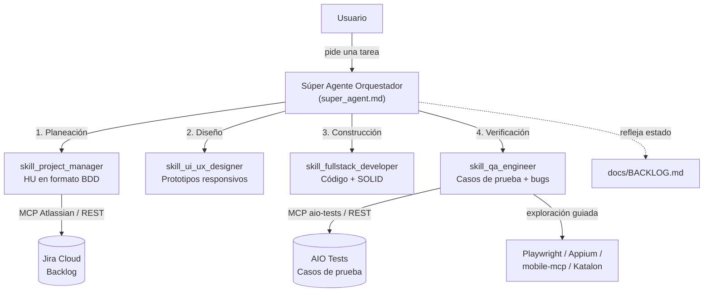

# AutoSquad-AI

Plantilla de **Súper Agente Orquestador** (Scrum Master AI) para conducir el ciclo de vida
completo de un proyecto ágil — planeación, diseño, construcción y QA — delegando cada fase a
skills de IA especializadas, integradas de forma nativa con herramientas reales de gestión de
proyectos (Jira, AIO Tests) y de automatización de pruebas (Playwright, Appium, Katalon).

No está atado a ningún dominio de negocio: los ejemplos de este repositorio (autenticación,
recordatorios, etc.) son ilustrativos. Clona el módulo que necesites y adapta las skills a tu
propio proyecto.

## Cómo funciona

Cada skill vive como una carpeta de *prompts* en `.prompts/<skill>/` con:
- `system.md` — rol, estándar de calidad y flujo de trabajo obligatorio de esa skill.
- `tools.md` — cómo se integra con el sistema externo real (MCP, API REST, CLI de respaldo).
- `examples.md` / `test_spec.md` / etc. — plantillas de invocación y ejemplos rellenos.

El orquestador (`super_agent.md`) no improvisa: si una skill referenciada en el catálogo no
tiene su carpeta implementada todavía, se detiene y lo informa en vez de simular su
comportamiento (ver la regla crítica en cada `super_agent.md`).

## Estructura del repositorio

| Módulo | Rol | Skills implementadas |
|---|---|---|
| [`FuncionalQaPm/`](FuncionalQaPm) | Gestión funcional de backlog y QA manual/exploratorio | `skill_project_manager`, `skill_qa_engineer` |
| [`AutomationBackend/`](AutomationBackend) | Automatización de pruebas de backend (pytest) | `skill_qa_engineer` |
| [`SDDTemplate/`](SDDTemplate) | Plantilla de desarrollo dirigido por especificación (backend + frontend) | `skill_fullstack_developer`, `skill_ui_ux_designer` |
| [`AutomationFrontend/`](AutomationFrontend) | Proyecto Katalon Studio de automatización de UI (web/móvil) | — (proyecto de automatización, no de orquestación) |

> Cada módulo evolucionó de forma independiente, así que hoy ningún módulo tiene las 4 skills
> completas a la vez. Para un ciclo de vida punta a punta, combina las carpetas `.prompts/`
> que necesites en un mismo proyecto.

## Integraciones reales configuradas

- **Jira Cloud**: creación de Historias de Usuario y reporte de bugs vía el MCP de Atlassian
  (`com.atlassian/atlassian-mcp-server`), con un script Python de contingencia (REST API) si el
  MCP no está disponible en la sesión.
- **AIO Tests** (gestión de casos de prueba sobre Jira Cloud): creación/actualización/búsqueda
  de Casos de Prueba vía MCP dedicado o cliente REST propio (`aio_tests_client.py`), con triage
  anti-duplicados obligatorio antes de crear un caso nuevo.
- **Automatización de exploración**: `playwright-mcp` / `aisquare-playwright` para web,
  `appium-mcp` / `mobile-mcp` para móvil, usados por `skill_qa_engineer` cuando un requerimiento
  es ambiguo y necesita evidencia real antes de diseñar un caso de prueba.

## Puesta en marcha

1. Elige el módulo (o combinación de módulos) que se ajuste a tu proyecto.
2. Copia `.prompts/<skill>/.env.example` a `.env` en cada skill que lo requiera y completa tus
   propias credenciales (Jira, AIO Tests) — **nunca** commitees el `.env` real.
3. Abre el proyecto con tu agente (Claude Code, Copilot, etc.) y activa `super_agent.md` como
   punto de entrada; él te guiará sobre qué skill activar según la fase en la que estés.
4. Personaliza `docs/BACKLOG.md` con el backlog real de tu propio proyecto Jira — el que viene
   en este repo es solo un ejemplo del formato esperado.

## Convenciones comunes a todas las skills

- Todo el contenido generado (HUs, casos de prueba, bugs) se redacta en español.
- Ninguna skill marca una tarea como `Done` sin pasar por verificación de QA.
- Ninguna skill inventa datos, IDs o campos de configuración que no haya podido confirmar
  contra la herramienta real — ante un error o un dato no verificable, se detiene e informa.
